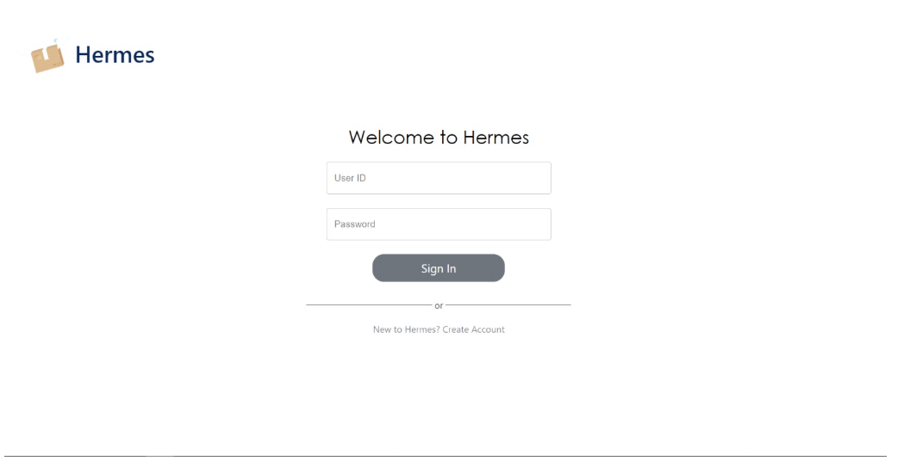
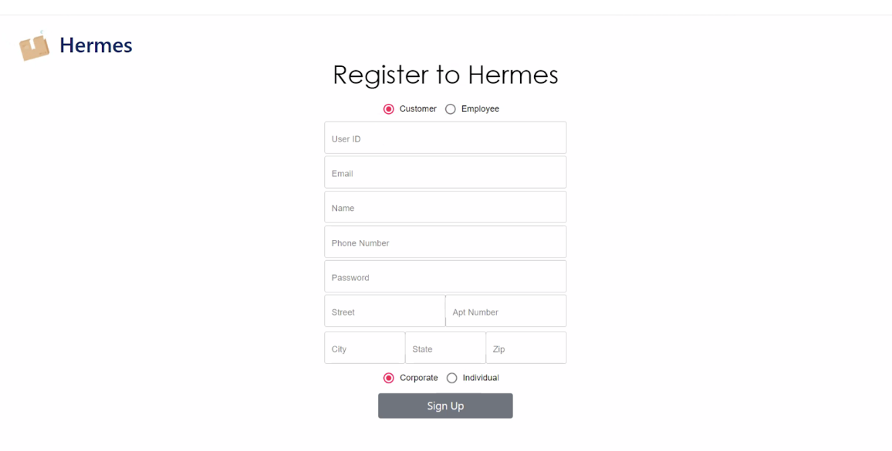
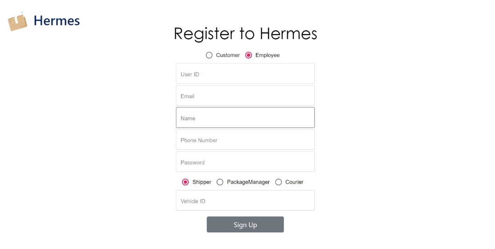
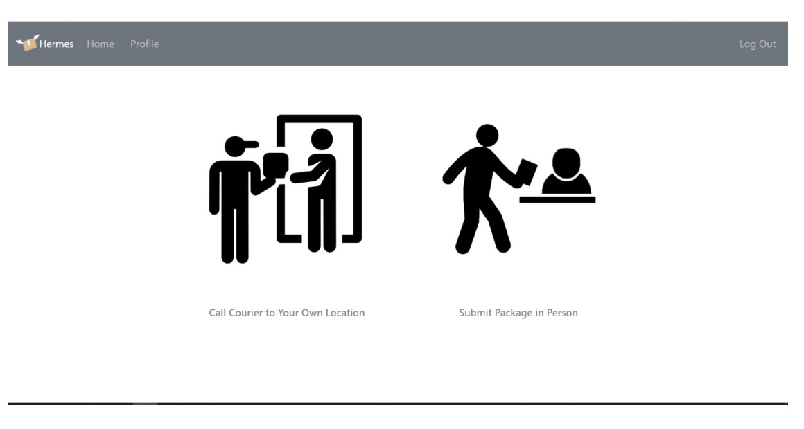
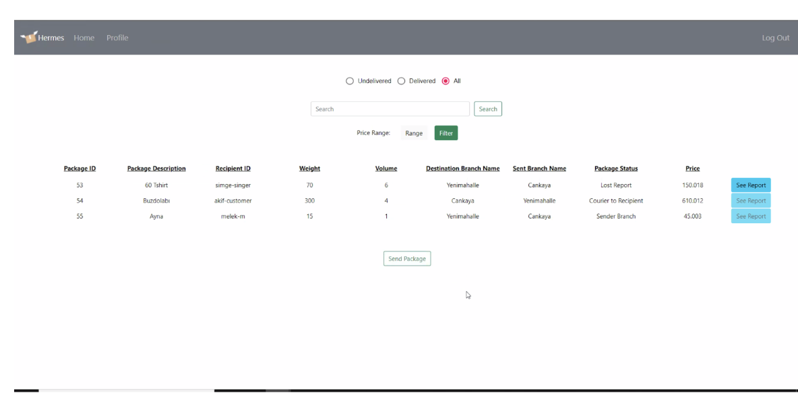
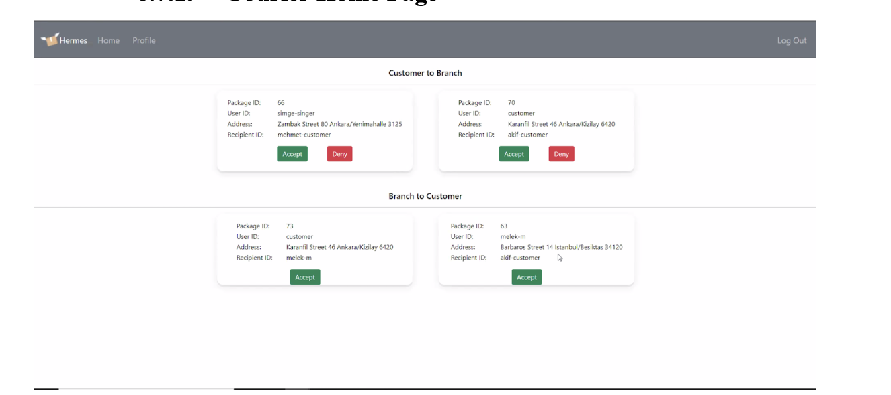
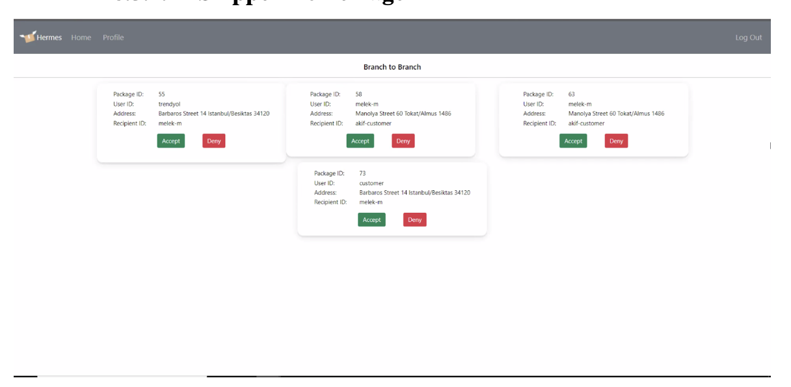
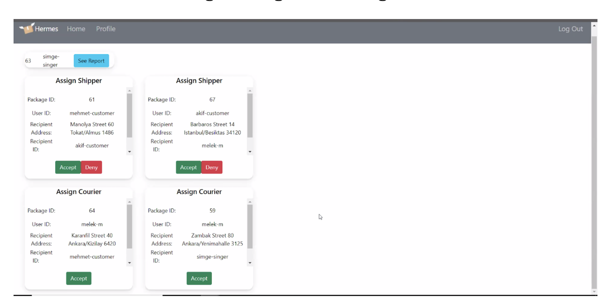
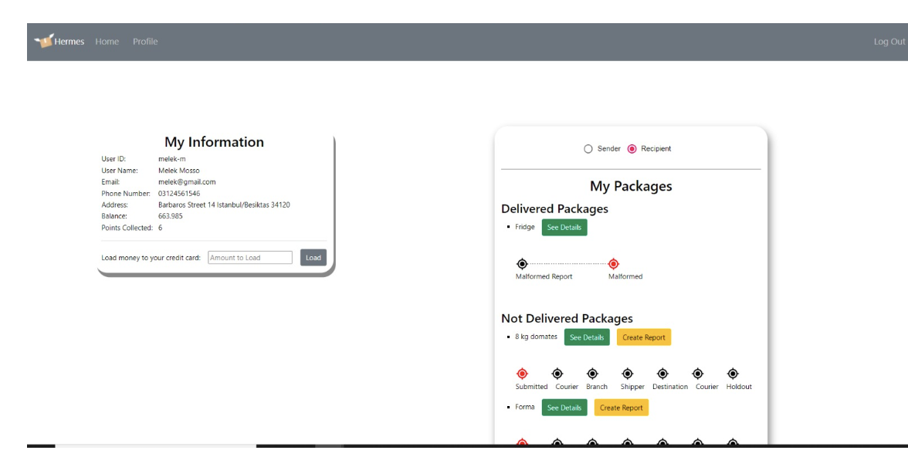
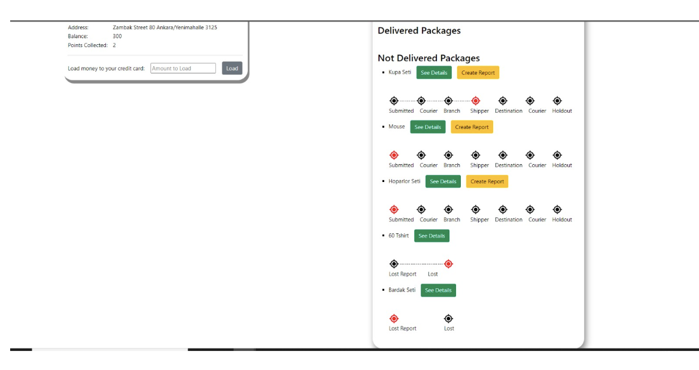

# 📦 Hermes Shipping Platform

A full-stack web-based shipping platform developed as a course project for **CS353 - Database Systems** at **Bilkent University**. Inspired by the Greek god Hermes—the herald and messenger of the gods—this platform facilitates the sending, receiving, and tracking of packages by individual and corporate customers.

  

---

## 🚀 Features

### 👥 User Roles
- **Individual Customers:** Submit packages via courier or branch, earn points, track deliveries, submit reports.
- **Corporate Customers:** Manage shipments, view reports, filter and search package records.
- **Couriers:** Handle pickups and deliveries; manage status updates.
- **Shippers:** Transport packages between branches.
- **Package Managers:** Assign couriers/shippers, handle lost/damaged reports.
- **Admins:** Manage branches, employees, and logistics routes.

### 📦 Package Workflow
- Call courier or submit in branch
- Dynamic assignment of available couriers/shippers
- Package tracking and status updates
- Reporting system for lost/malformed deliveries

### 🛠️ Database Features
- **Triggers:** Automatically reward customers with points upon package submission.
- **Views:** Display employees with roles on the admin page.
- **Relational integrity:** 22 normalized relational schemas with keys and constraints.
- **Advanced queries:** Filtering, searching, conditional display logic.

---

## 🧰 Tech Stack

| Layer         | Technology Used            |
|---------------|-----------------------------|
| Front-End     | React.js, CSS               |
| Back-End      | Node.js                     |
| Database      | PostgreSQL on Google Cloud  |
| Development   | Visual Studio Code, IntelliJ |
| Diagrams      | GitMind                     |

---

## 📊 ER Diagram & Database Schema

The database schema includes detailed relations for:
- Users (individual, corporate, employee types)
- Packages and Orders
- Branches and Routes
- Reports and States
- Vehicles and Assignments

➡️ See full ER diagram and relational schema in the [Final Report](https://github.com/ilke-kas/Hermes/blob/bdc1b622957b653628b2adac24c743949267f710/reports/Final%20Report%20CS353.pdf).

---

## 🔐 Functionality by User Type

### Individual Customers
- Sign up / log in
- Submit packages (Courier / Branch)
- Track delivery status
- View and manage profile
- File lost/damaged package reports
- Earn points for each submission

### Corporate Customers
- Filter/search shipments by status or price
- Access report details
- Load money to account

### Couriers & Shippers
- Accept/decline pickup or delivery jobs
- Report delivery issues
- View assigned tasks and vehicle info

### Package Managers
- Assign shippers or couriers
- Review customer reports (approve/deny)
- Monitor all packages associated with their branch

### Admins
- Create/close branches
- Create routes
- Fire employees
- View all branches and associated employees

---

## 📷 Sample Screenshots

> Example screenshots include:
- Login
  
- Registration - Individual
  
- Registration - Employee
  
- Individual Customer Dashboard
  
- Corporate Customer Dashboard
  
- Courier Dashboard
  
- Shipper Dashboard
  
- Package Manager Dashboard
  
- Individual Customer Profile
  
  
- Lost Package Reporting
  
- Package Manager Reports
  

> 📎 Full walkthrough available in the [Final Report](https://github.com/ilke-kas/Hermes/blob/bdc1b622957b653628b2adac24c743949267f710/reports/Final%20Report%20CS353.pdf)

---

## 📝 Team Members

| Name                    | Student ID  | Contribution                                   |
|-------------------------|-------------|------------------------------------------------|
| İlke Kaş                | 21803184    | Backend (Node.js), Database Setup ,Frontend (UI), SQL Queries               |
| Zeynep Büşra Ziyagil    | 21802646    | Frontend (UI), SQL Queries                     |
| Bilgehan Akcan          | 21802901    | UI Implementation, Schema Design               |
| Ömer Onat Postacı       | 21802349    | API and SQL Query Implementation               |

---

## 📣 Notes

✅ This project was developed as part of **CS353 - Database Systems** at **Bilkent University**.  
✅ All functionality was tested by the team, and the full stack system is operational and deployed for demo purposes.

---

